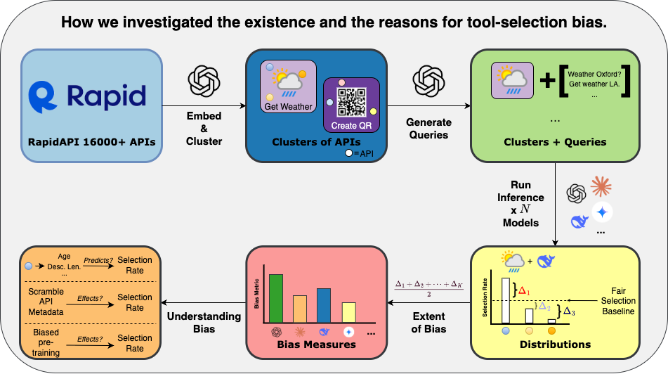

<div align= "center">
    <h1> Tool-Selection Bias in LLMs </h1>
</div>

<p align="center">
  <a href="#model">Quick Setup</a> •
  <a href="#data">Overall Structure</a> •
  <a href="#citation">Citation</a>
</p>

</div>

This repo contains the code to reproduce my MSc thesis on tool-selection bias: the tendency of LLMs to prefer some APIs over functionally equivalent alternatives. It includes:
- A bias benchmark (10 clusters × 5 APIs × 100 queries),
- Experiments showing API/position bias across 7 model families,
- Feature-level analysis & metadata perturbations,
- A biased continued pre-training (CPT) study,
- A lightweight subset-selection mitigation that reduces bias.

Built on top of [ToolBench / ToolLLM](https://github.com/OpenBMB/ToolBench). Please also see their license and citation.

Here is an overview of the different phases in measuring and understanding tool-selection bias.
First, we embed and cluster the existing APIs in ToolLLM, then generate
queries for each cluster such that each API within the cluster can satisfy the query to
create our bias-evaluation benchmark. We run inference on this benchmark
using various models, compute the empirical selection distributions and our
bespoke bias metric, and finally investigate why models exhibit particular
biases via a range of different experiments.

<br>
<div align="center">

</div>
<br>

## Quick Setup
Please download the ToolLLM dataset using the following link [Google Drive](https://drive.google.com/uc?id=1vzUpO2TadV97upKwLn-TWHA-PR57Vs2H).
*Please make sure you have downloaded the necessary data and put the directory (e.g. `data/`) under `ToolBench/`, so that the following bash scripts can navigate to the related data.*


## Overall Structure

### Dataset Generation

👐ToolBench is intended solely for research and educational purposes and should not be construed as reflecting the opinions or views of the creators, owners, or contributors of this dataset. It is distributed under Apache License 2.0. Below is the statistics of the data :

| Tool Nums | API Nums | Instance Nums | Real API Call | Reasoning Traces |
|-----------|----------|---------------|---------------|------------------|
| 3451      | 16464    | 126486         | 469585         | 4.0            |

We crawl 16000+ real-world APIs from [RapidAPI](https://rapidapi.com/hub), and curate realistic human instructions that involve them. Below we present a hierarchy of RapidAPI and our instruction generation process.

<br>
<div align="center">

</div>
<br>

ToolBench contains both single-tool and multi-tool scenarios. The multi-tool scenarios can be further categorized into intra-category multi-tool and intra-collection multi-tool. We utilize DFSDT method for all scenarios to our data creation. Here is an illustration for the data creation process using DFSDT method:

<div align="center">


</div>

### Analyzing Data

### Bias Investigation

### Bias Mitigation


## Citation
Feel free to cite us if you like ToolBench.
```bibtex
@misc{qin2023toolllm,
      title={ToolLLM: Facilitating Large Language Models to Master 16000+ Real-world APIs}, 
      author={Yujia Qin and Shihao Liang and Yining Ye and Kunlun Zhu and Lan Yan and Yaxi Lu and Yankai Lin and Xin Cong and Xiangru Tang and Bill Qian and Sihan Zhao and Runchu Tian and Ruobing Xie and Jie Zhou and Mark Gerstein and Dahai Li and Zhiyuan Liu and Maosong Sun},
      year={2023},
      eprint={2307.16789},
      archivePrefix={arXiv},
      primaryClass={cs.AI}
}
```

```bibtex
@misc{qin2023tool,
      title={Tool Learning with Foundation Models}, 
      author={Yujia Qin and Shengding Hu and Yankai Lin and Weize Chen and Ning Ding and Ganqu Cui and Zheni Zeng and Yufei Huang and Chaojun Xiao and Chi Han and Yi Ren Fung and Yusheng Su and Huadong Wang and Cheng Qian and Runchu Tian and Kunlun Zhu and Shihao Liang and Xingyu Shen and Bokai Xu and Zhen Zhang and Yining Ye and Bowen Li and Ziwei Tang and Jing Yi and Yuzhang Zhu and Zhenning Dai and Lan Yan and Xin Cong and Yaxi Lu and Weilin Zhao and Yuxiang Huang and Junxi Yan and Xu Han and Xian Sun and Dahai Li and Jason Phang and Cheng Yang and Tongshuang Wu and Heng Ji and Zhiyuan Liu and Maosong Sun},
      year={2023},
      eprint={2304.08354},
      archivePrefix={arXiv},
      primaryClass={cs.CL}
}
```

```bibtex
@misc{guo2024stabletoolbench,
      title={StableToolBench: Towards Stable Large-Scale Benchmarking on Tool Learning of Large Language Models},
      author={Guo, Zhicheng and Cheng, Sijie and Wang, Hao and Liang, Shihao and Qin, Yujia and Li, Peng and Liu, Zhiyuan and Sun, Maosong and Liu, Yang},
      year={2024},
      eprint={2403.07714},
      archivePrefix={arXiv},
      primaryClass={cs.CL}
}
```
